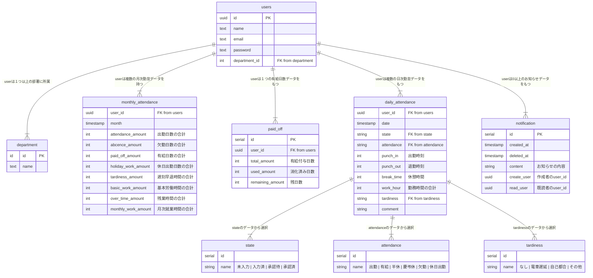

```mermaid

erDiagram

users||--|{ department: "userは１つ以上の部署に所属"
users||--|{ monthly_attendance: "userは複数の月次勤怠データを持つ"
users||--|{ paid_off: "userは１つの有給日数データをもつ"
users||--|{ daily_attendance: "userは複数の日次勤怠データをもつ"
users||--|{ notification: "userは0以上のお知らせデータをもつ"
daily_attendance||--|{ state: "stateのデータから選択"
daily_attendance||--|{ attendance: "attendanceのデータから選択"
daily_attendance||--|{ tardiness: "tardinessのデータから選択"


users{
  uuid id PK
  text name
  text email
  text password
  int department_id "FK from department"
}

department {
  id id PK
  text name
}

daily_attendance {
  uuid user_id "FK from users"
  timestamp date
  string state "FK from state"
  string attendance "FK from attendance"
  int punch_in "出勤時刻"
  int punch_out "退勤時刻"
  int break_time "休憩時間"
  int work_hour  "勤務時間の合計"
  string tardiness "FK from tardiness"
  string comment
}

monthly_attendance {
  uuid user_id "FK from users"
  timestamp month
  int attendance_amount "出勤日数の合計"
  int abcence_amount "欠勤日数の合計"
  int paid_off_amount "有給日数の合計"
  int holiday_work_amount "休日出勤日数の合計"
  int tardiness_amount "遅刻早退時間の合計"
  int basic_work_amount "基本労働時間の合計"
  int over_time_amount "残業時間の合計"
  int monthly_work_amount "月次就業時間の合計"
}

state {
  serial id
  string name "未入力 | 入力済 | 承認待 | 承認済"
}

attendance {
  serial id
  string name "出勤 | 有給 | 半休 | 慶弔休 | 欠勤 | 休日出勤"
}

tardiness {
  serial id
  string name "なし | 電車遅延 | 自己都合 | その他 "
}

paid_off {
  serial  id "PK"
  uuid    user_id "FK from users"
  int     total_amount "有給付与日数"
  int     used_amount  "消化済み日数"
  int     remaining_amount  "残日数"
}

notification {
  serial      id "PK"
  timestamp   created_at
  timestamp   deleted_at
  string      content "お知らせの内容"
  uuid        create_user "作成者のuser_id"
  uuid        read_user "既読者のuser_id"
}

```
