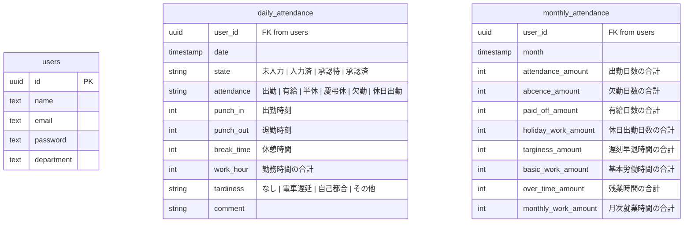

```mermaid

erDiagram

users{
  uuid id PK
  text name
  text email
  text password
  text department
}

daily_attendance {
  uuid user_id "FK from users"
  timestamp date
  string state "未入力 | 入力済 | 承認待 | 承認済"
  string attendance "出勤 | 有給 | 半休 | 慶弔休 | 欠勤 | 休日出勤"
  int punch_in "出勤時刻"
  int punch_out "退勤時刻"
  int break_time "休憩時間"
  int work_hour  "勤務時間の合計"
  string tardiness "なし | 電車遅延 | 自己都合 | その他 "
  string comment
}

monthly_attendance {
  uuid user_id "FK from users"
  timestamp month
  int attendance_amount "出勤日数の合計"
  int abcence_amount "欠勤日数の合計"
  int paid_off_amount "有給日数の合計"
  int holiday_work_amount "休日出勤日数の合計"
  int targiness_amount "遅刻早退時間の合計"
  int basic_work_amount "基本労働時間の合計"
  int over_time_amount "残業時間の合計"
  int monthly_work_amount "月次就業時間の合計"
}

```
